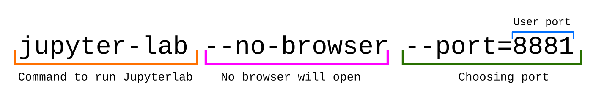

# Hardware


<details>
     <summary>:black_small_square: <b>RAM</b></summary>


```
     total        used        free      shared  buff/cache   available
Mem: 115Gb       340Mb        98Gb       1.0Mb        15Gb       113Gb
Swap:   0B          0B          0B

```
</details>


<details>
     <summary>:black_small_square: <b>CPU</b></summary>

```
Architecture:                    x86_64
CPU op-mode(s):                  32-bit, 64-bit
Byte Order:                      Little Endian
Address sizes:                   46 bits physical, 48 bits
                                  virtual
CPU(s):                          14
On-line CPU(s) list:             0-13
Thread(s) per core:              1
Core(s) per socket:              1
Socket(s):                       14
NUMA node(s):                    1
Vendor ID:                       GenuineIntel
CPU family:                      6
Model:                           61
Model name:                      Intel Core Processor (Bro
                                 adwell, IBRS)
Stepping:                        2
CPU MHz:                         2399.996
BogoMIPS:                        4799.99
Hypervisor vendor:               KVM
Virtualization type:             full
L1d cache:                       448 KiB
L1i cache:                       448 KiB
L2 cache:                        56 MiB
L3 cache:                        224 MiB
NUMA node0 CPU(s):               0-13
```
</details>


<details>
     <summary>:black_small_square: <b>GPU</b></summary>

```
description: 3D controller
product: GP100GL [Tesla P100 PCIe 16GB]
vendor: NVIDIA Corporation
physical id: 5
bus info: pci@0000:00:05.0
version: a1
width: 64 bits
clock: 33MHz
capabilities: pm msi pciexpress bus_master cap_list
configuration: driver=nvidia latency=0
resources: iomemory:200-1ff iomemory:240-23f irq:11 memory:fd000000-fdffffff memory:2000000000-23ffffffff memory:2400000000-2401ffffff
```
</details>

# Config

- In **/opt/work/** are located the Darknet directory and weights
  
  - **/opt/work/** have 777 rights 

- To connect into the server we have to change the SSH port to **2222** with **-p 2222**

# Installed:

- Nvidia drivers, CUDA and CUDNN

- vim

- libopencv-dev

- opencv-python

- Python3-pip

- python3 -m pip install jupyterlab  **# Each user need to install it in order to get it working individually.**
  - After you installed it. Add this into **.bashrc**:  ```export PATH="$HOME/.local/bin:$PATH"```
  - Highly recommend to put **password** to access into Jupyterlab. Do this the first time you run the jupyterlab.

- nomacs

# nomacs (Image viewer)

If you want to load an image run (Remember X11 flag):
```
nomacs imame.jpg
```

# X11forwarding:

When we run the the predictions we get back a picture with the predictions in coloured boxes and written in the terminal.

In order to get **windows** predicctions over SSH we enabled the X11forwarding.


To get into the SSH with the X11forwarding permissions add the flag **-X** :

```bash
ssh -X name@IP -P 2222
```


# Access into Jupyter-lab:

In case we have multiple users in the server and we will them use jupyterlab, each user need to install jupyterlab and choose a port for each user also as this example:
| Username      | port     |
| :------------- | :----------: |
|  user1 | **8881**   |
| user2   | **8882** |


1. To check if we have Jupyter-lab running you will get back the PID number with this command: ```pgrep jupyter-lab```
   -  In case we don't have jupyter running:

```
cd /opt/work/
jupyter-lab --no-browser --port=8881
```



2. Command to run in our computer:
```
ssh -N -f -L localhost:8888:localhost:8881 username@server_IP -p 2222
```


3. Open browser and type:
```
localhost:8888
```

# Doing a training with **tmux**
If we do a training connected by SSH and we lost the conection, all will be gone.
So using **tmux** we can have a session attached and with can disconect and reconect and we will have the session working all the time until we remove it.

#### Creating a session called "work":
```
tmux new -s work
```

🛠 Now we can run our training ...

#### ↪️ To deattach the session press:
Ctrl + b, d

Now we can left the server without any problem 🆒! .

#### ↩️ To attach again into the last session use:
Ctrl + b, a
